# Welcome to SNEK gallery!
## Windows screenshots

  
  ReactOS 0.4.14 - Open-source NT
  
  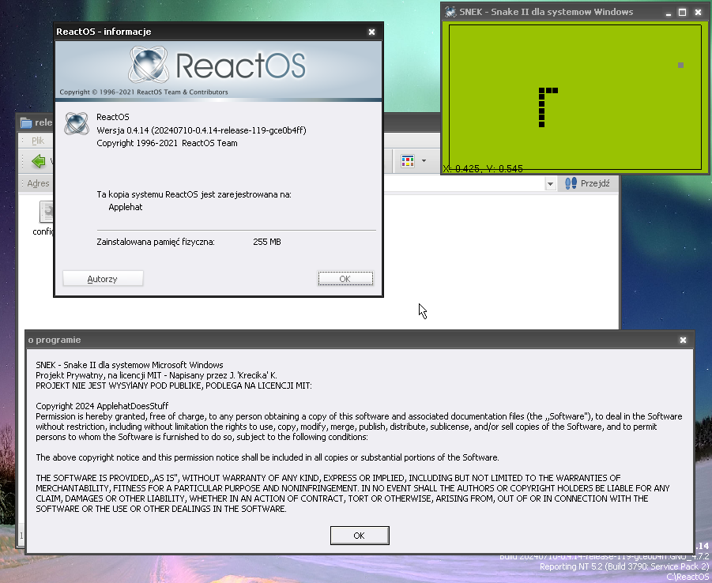

  Windows 7 Ultimate [x64]

  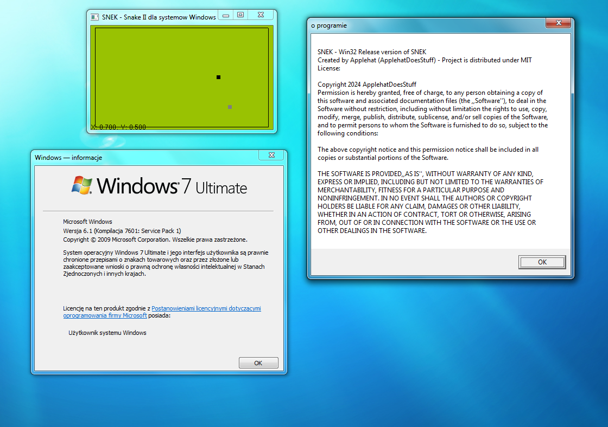

  Windows 2000 Professional 

  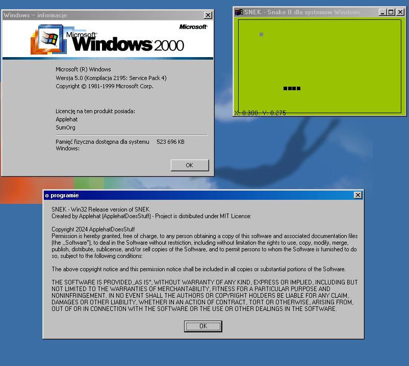

  Windows 98 Second Edition

  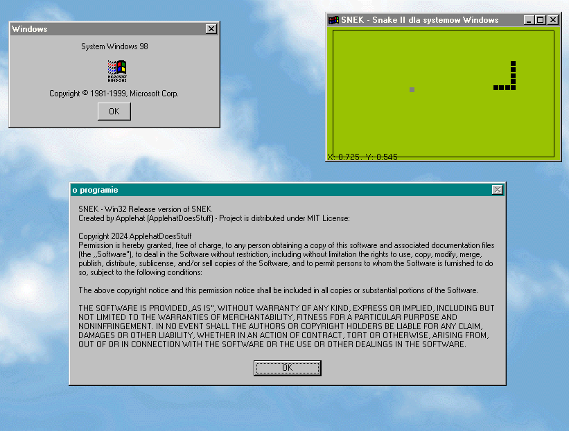

  Windows 11 
  
  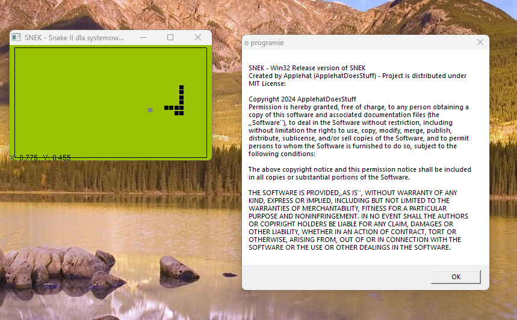

  Dell Latitude D410

  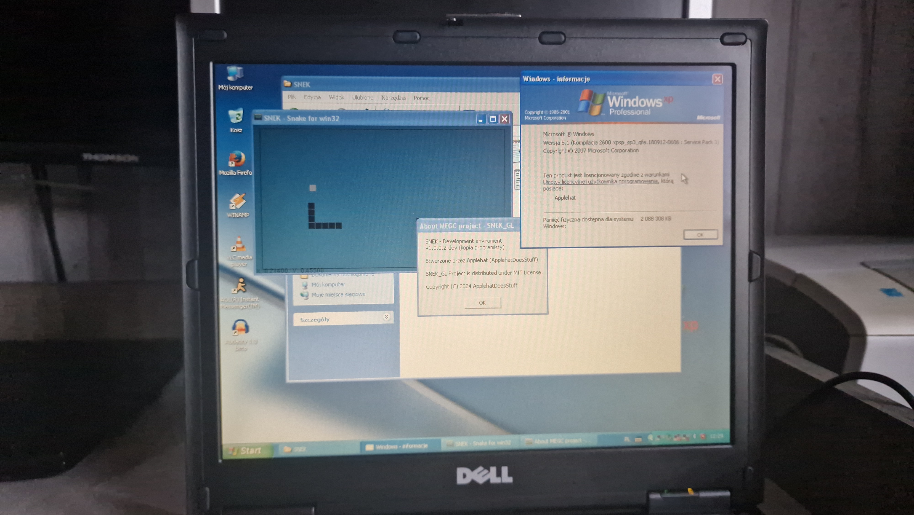

## Linux screenshots
#### about running SNEK on linux distributions - reading <a href="https://github.com/ApplehatDot/SNEK_GL/blob/main/docs/COMPILE.md#compiling-snek-for-linux">docs/COMPILE.md</a> is recommended.a>

  
  Ubuntu 7.10 [x86] - Najstarsza dystrybucja Ubuntu która uruchamia SNEKa

  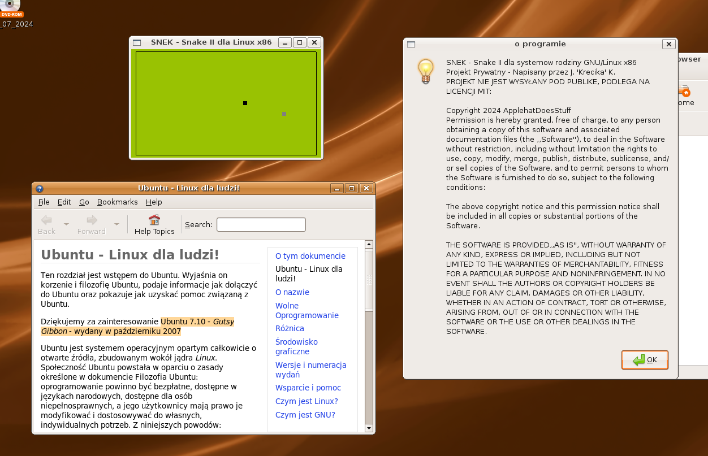

  Ubuntu 11.04 [x86] - on that version the very first port was compiled

  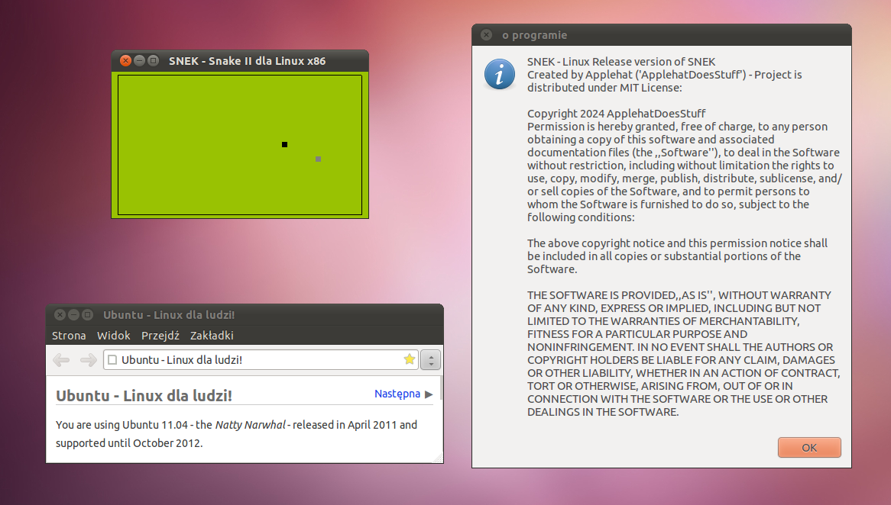
  
  Ubuntu 22.04.6 [x64]
  
  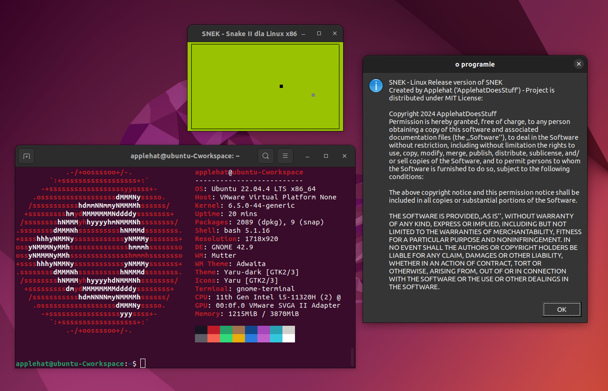
 
  Ubuntu 18.04.6 LTS [x64; Dualbooted] on Lenovo MIIx 300-10iby

  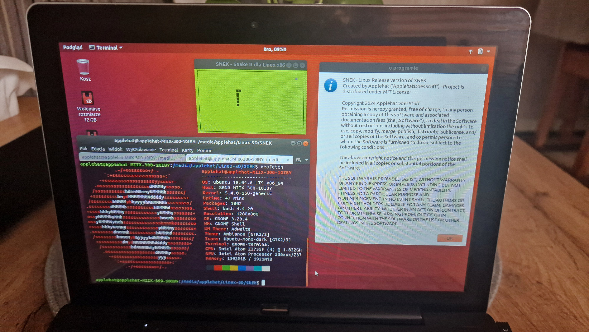

  Lubuntu 18.04.5 LTS [x64; Dualbooted] on Lenovo MIIx 300-10iby

  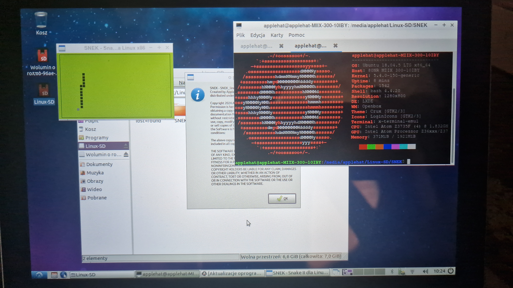

