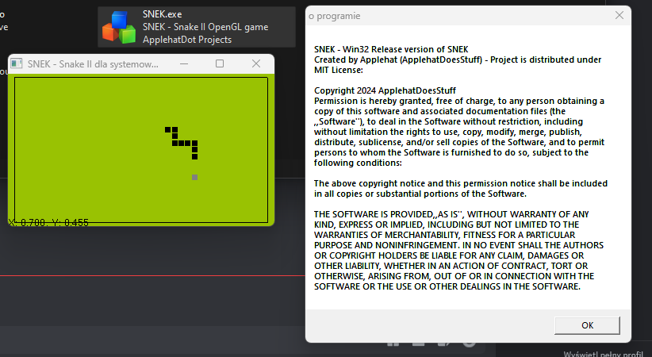

  

SNEK - OpenGL Game Project in C and C++ of Snake II from Nokia 5110, basically a snake clone but with additional stuff.

To compile project yourself, read <a href="https://github.com/ApplehatDot/SNEK/blob/main/docs%2FCOMPILE.md">COMPILE.md</a>

Win32 release works from Windows 98 to Windows 11, aswell on ReactOS and Whistler 2419

# compatibility list of different Versions for:
## Win32:
- Windows 95 [unknown]
- ~Windows NT 4.0~ [missing `EnumDisplayMonitors` procedure in USER32.dll]
- Windows 98
- Windows 2000
- Windows XP [x86]
- Windows 7 [x86 i x64]
- Windows 8 [x86 i x64]
- Windows 10 [x86 i x64]
- Windows 11 [x64]
- ReactOS 0.4.14 [x86]

## Win32 Betas:
- Microsoft Whistler Build 2419 [x86; real hardware]

Screenshot Gallery of each OS — <a href="https://github.com/ApplehatDot/SNEK/blob/main/Gallery%2FGallery.md">Gallery/Gallery.md</a>

