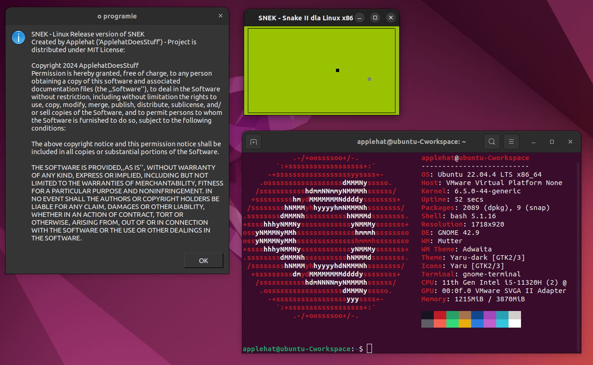
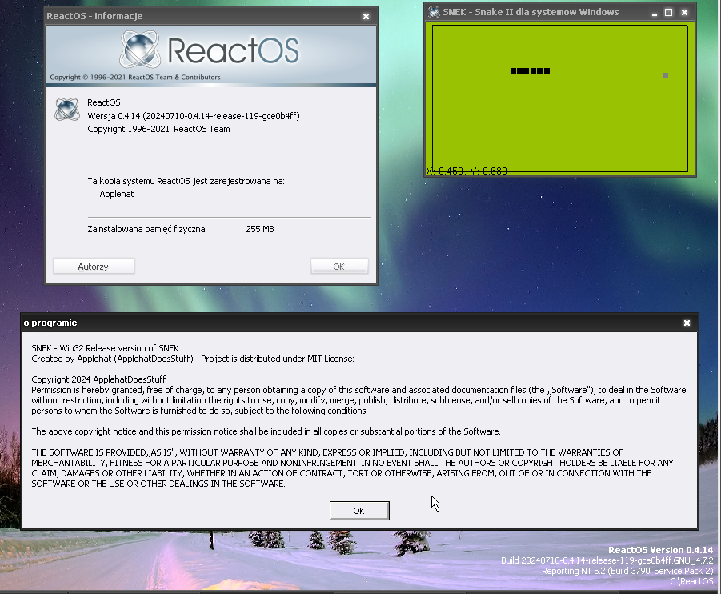

# SNEK (main/original fork)

  English docs (SNEK-english-docs fork) - <a href="https://github.com/ApplehatDot/SNEK/tree/SNEK-english-docs">Click here</a>
  

SNEK - projekt w języku (czystego) C i OpenGL gry Snake II ze wzoru z Nokii 5110

projekt ma dwa wersje - Linux_x86 i dla Win32, które działają tak samo.
wersja dla systemów rodziny Linux - działa od ubuntu 11.04 (nie testowałem jeszcze wcześniejszych ani nowszych.)

Aby skompilować samemu (co będziesz musiał :) użyj pliku <a href="https://github.com/ApplehatDot/SNEK/blob/main/docs%2FCOMPILE.md">COMPILE.md</a>

a port dla win32 działa od Windows 98 do Windows 11 (windows XP ma problemy.)

# Lista Wersji na jakich działają porty:
## Win32:
- Windows NT 4.0 [Brak procedury `EnumDisplayMonitors` w USER32.dll]
- Windows 98
- Windows 2000
- ~Windows XP~ [działa ale ostro się zawiesza, problemy z grafiką]
- Windows 7 [x86 i x64] na nim kompilowano wersje win32
- Windows 8 [x86 i x64]
- Windows 10 [x86 i x64]
- Windows 11
- ReactOS 0.4.14 [x86?]

## Linux_x86 (i Linux_x64...)
- Ubuntu 7.10 [x86]
- Ubuntu 11.04 [x86] na nim kompilowano wersje Linux_x86
- Ubuntu 22.04.6 [x64]

Galeria screenshotów z danych systemów — <a href="https://github.com/ApplehatDot/SNEK/blob/main/Gallery%2FGallery.md">Gallery/Gallery.md</a>

