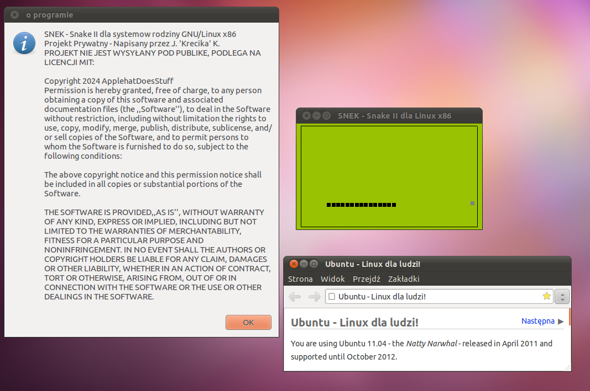
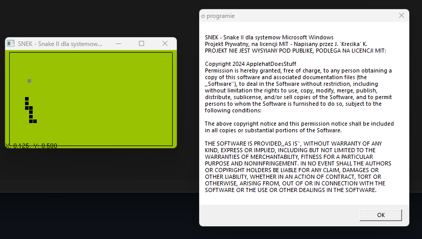

# SNEK (SNEK-english-docs fork)
SNEK - OpenGL Game Project in C of SNake II from Nokia 5110

Project has two distributions - Linux_x86 and Win32, that work the same.
Linux release works from ubuntu 11.04 [x86] to ubuntu 24.04 [x64]

To compile project yourself (which in order to use it, you have to :) use <a href="https://github.com/ApplehatDot/SNEK/blob/main/docs%2FCOMPILE.md">COMPILE.md</a>

Win32 release works from Windows 98 to Windows 11, aswell on ReactOS (Windows XP has issues)

# compatibility list of different Versions for:
## Win32:
- Windows NT 4.0 [missing `EnumDisplayMonitors` procedure in USER32.dll]
- Windows 98
- Windows 2000
- ~Windows XP~ [opens up but hangs by itself and has graphical issues]
- Windows 7 [x86 i x64] on that version the win32 was compiled in
- Windows 8 [x86 i x64]
- Windows 10 [x86 i x64]
- Windows 11 [x64]
- ReactOS 0.4.14 [x86?]

## Linux_x86 (and Linux_x64...)
- Ubuntu 11.04 [x86] on that version the Linux release was compiled in
- Ubuntu 22.04.6 [x64] 

Screenshot Gallery of each OS — <a href="https://github.com/ApplehatDot/SNEK/blob/main/Gallery%2FGallery.md">Gallery/Gallery.md</a>

