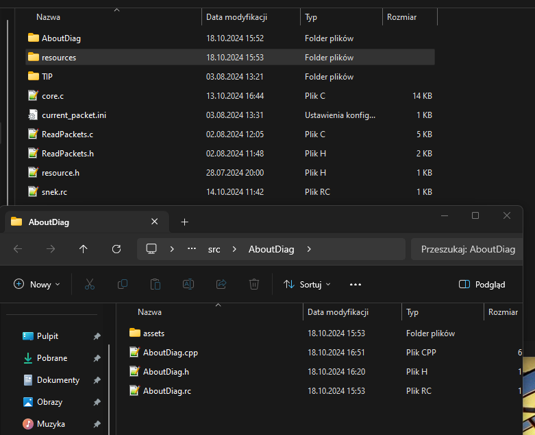
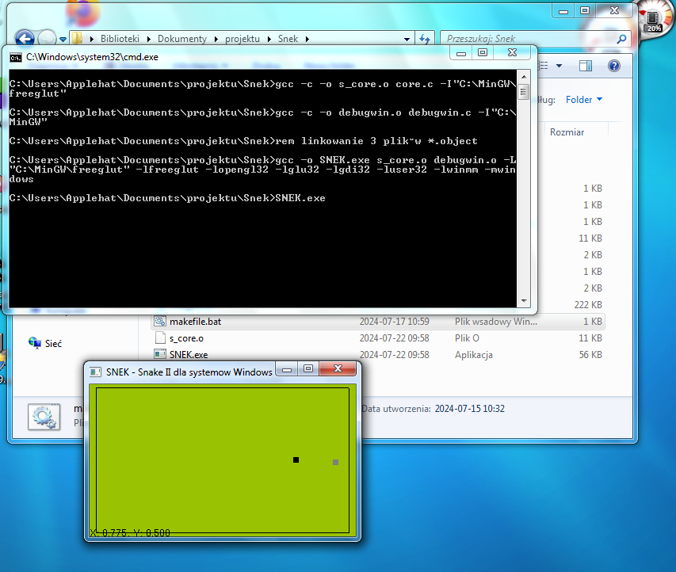
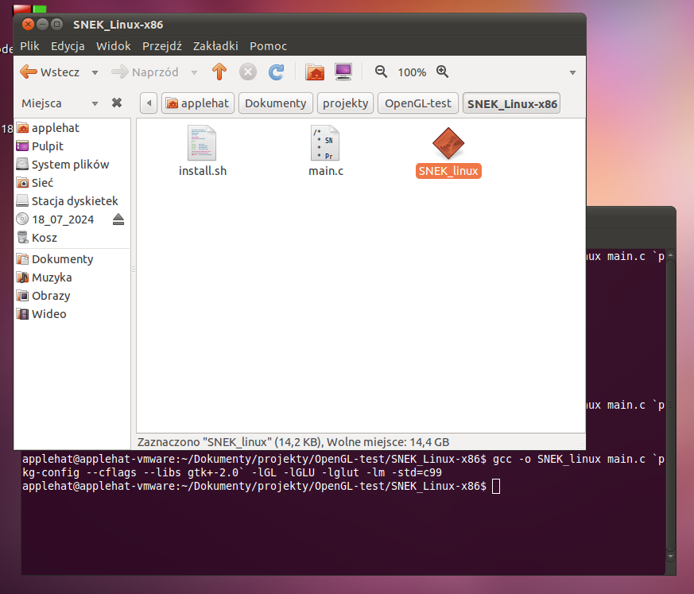
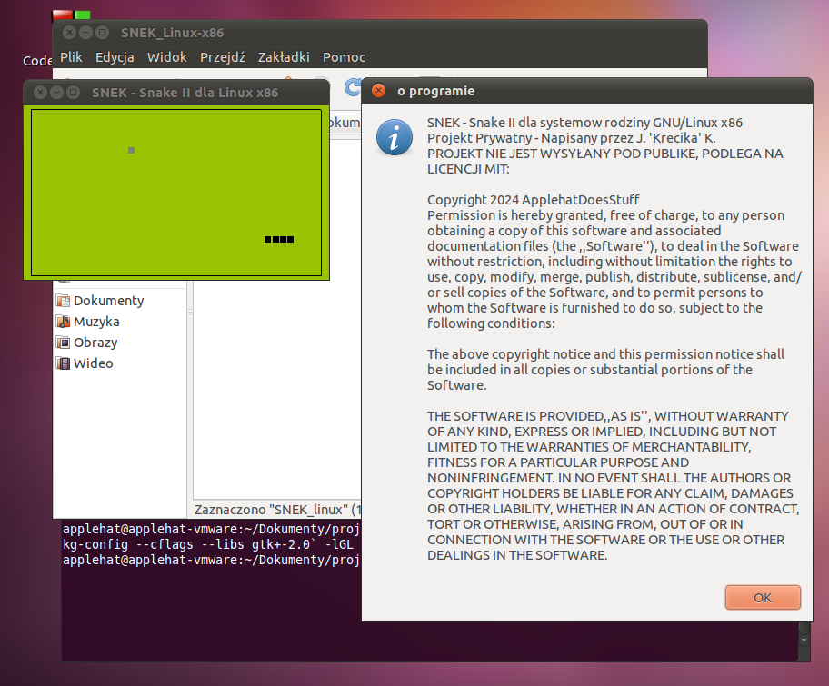

*Compiling tutorial for Linux is under - or just press <a href=https://github.com/ApplehatDot/SNEK/blob/main/docs/COMPILE.md#kompilacja-gierki-snek-dla-system%C3%B3w-rodziny-linux>here...</a>*

# Compiling SNEK for win32 
Compiling SNEK (this project) for Microsoft Windows (win32) requires a MinGW 6.2.0 compiler and a code editor (if you will change some fragments in the code). Having win32 source files from `SNEK/source/win32/`
<div align="center">
  
</div>

what I do when compiling, is creating `make.bat` and there i add lines for compiling, something like make does:
```batch
rem Having freeglut files at C:\MinGW\freeglut\
gcc -c -o s_core.o core.c -I"C:\MinGW\freeglut"
gcc -c -o debugwin.o debugwin.c -I"C:\MinGW"

rem linking 3 object files to one executable
gcc -o SNEK.exe s_core.o debugwin.o -L"C:\MinGW\freeglut" -lfreeglut -lopengl32 -lglu32 -lgdi32 -luser32 -lwinmm -mwindows
SNEK.exe
```

by running `make.bat` it'll compile the application and will run it - 
### Congratulations! You've compiled win32 release of SNEK!



# Compiling SNEK for Linux 
### `NOTE: Compiling process for SNEK is dynamic (to run sucessfully, a computer will require libraries installed); The application must be compiled on the same Computer, where it will be executed (any kind of tips/help would be needed :,)`

Firstly, to compile SNEK for Linux you must libraries:
```bash
sudo apt-get update
sudo apt-get install libgtk2.0-dev freeglut3 freeglut3-dev libglew-dev libglu1-mesa-dev
```
along with GCC compiler.
When files are in the folder, open up the terminal and execute these commands (in the folder where files are):
```bash
$ gcc -o SNEK_linux main.c `pkg-config --cflags --libs gtk+-2.0` -lGL -lGLU -lglut -lm -std=c99
$ ./SNEK_linux
```




### Congratulations! You've Compiled Linux release of SNEK!




